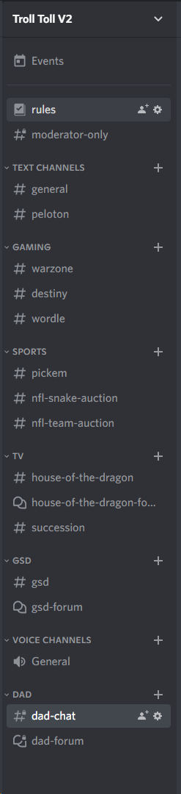
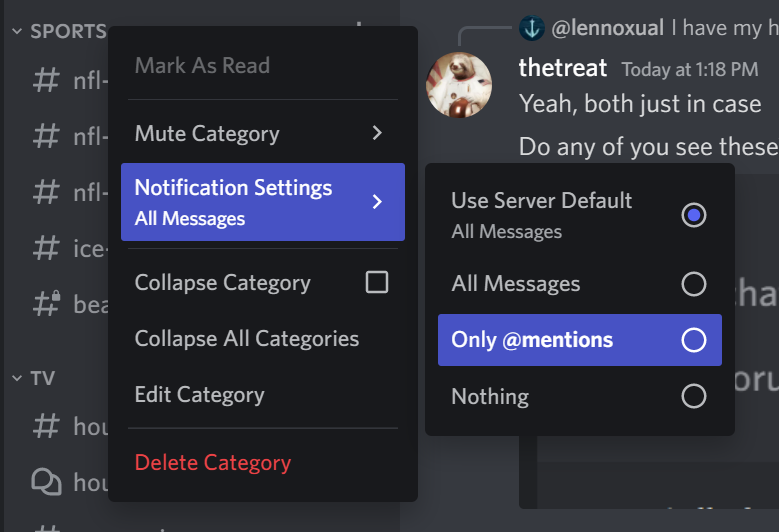
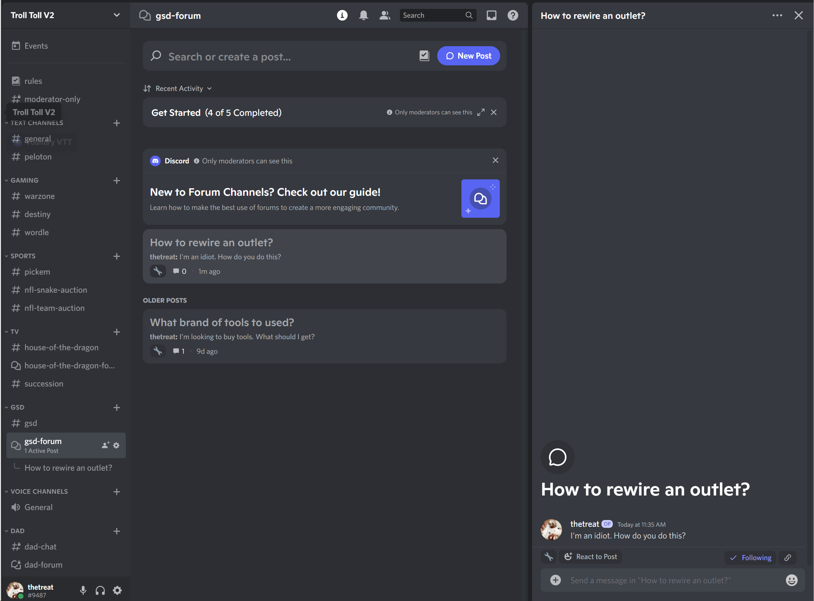
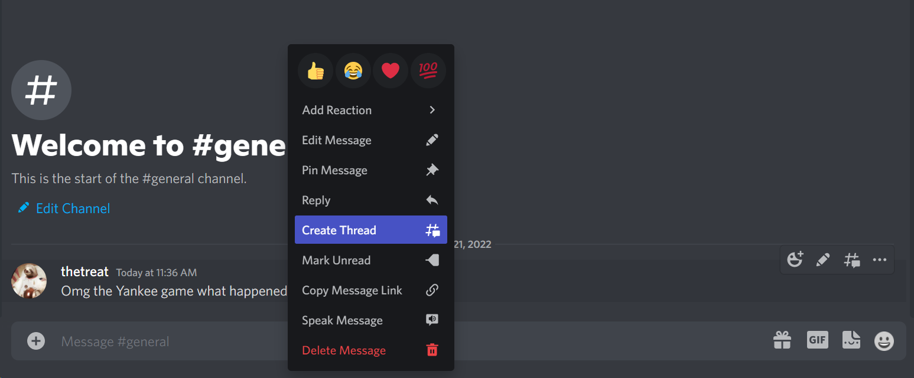
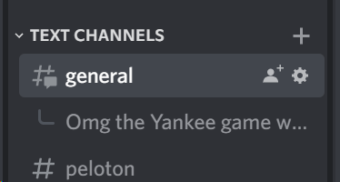
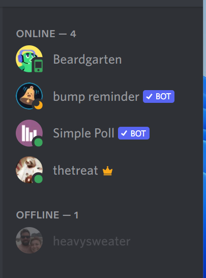
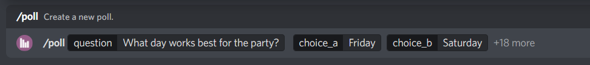
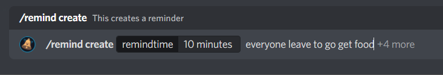
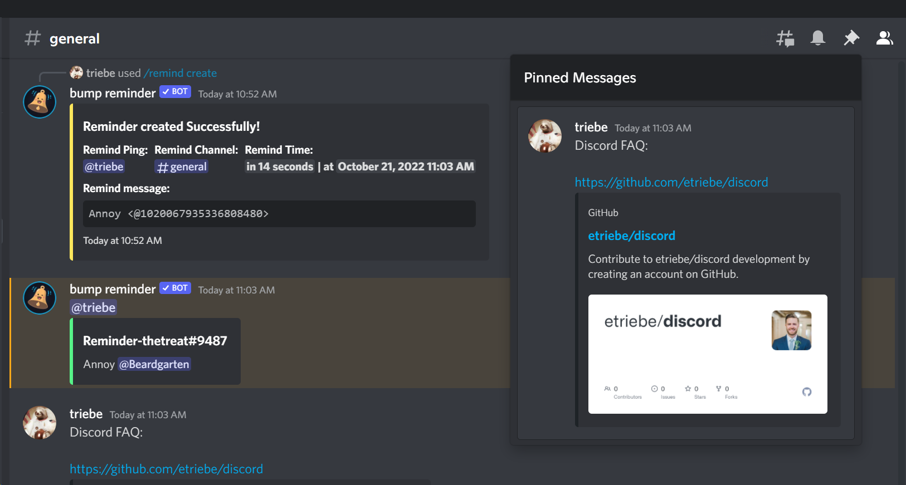

# Discord FAQ

## Channel Organization

Feel free to create other channels. I think everyone should have permissions to. When creating, you can choose if you want it be private or not and only invite some members. 

## Notification Settings

Right click on any channel or group of channels and you can set notification settings for these.

## Forum Channels

Forum channels are like classic forums from back in the day. Use these for instances where discussion is not time-sensitive. Like for GSD, tool recommendations or how to do a particular project/task. For dad channel it might be stroller, car seat recommendations. 

## Threads

Threads can be perfect for events like a sporting event: something that is transient and discussion isn't super intersting beyond a few days.

Threads will show in a particular channel's child structure but will disappear from here after 24 hours of no messages. I believe they can still be found, though. 

## Online Status

Look! You can see when your friends are online and what type of device they're on. Neat!

## Bots

Discord has chat bot integration, which can be super useful. If there are bots you want to add, let me know. Be warned, there are possibly a million anime-focused bots. Weebs love Discord. Also a ton of soccer-related bots. 

https://top.gg/

## Polls

Type /poll for creating simple polls.

## Reminders

Type /remind and you'll see example commands you can do to bring your attention back to a particular message or remind yourself to do something. 

## Slash commands

Discord has built in support commands like referenced above for creating a poll, a reminder or searching for a gif. Just type / and you'll see all the options.

## Pinned Messages
View pinned messages. Click on the pin in the upper right. Let me know if you want a particular message pinned. Useful for things people might want to be able to reference for some period of time. Pinned messages can be unpinned. Just let me know. 

